# Performance considerations

> **Reading date:** 2026-06-13  
> **Status:** 🔄 In Progress / ✅ Done

---

## **backgroud**

Global memory access is slow. To understand why, we walk through
the full 7-step process from request to data return.
The global memory of CUDA device is implemented with DRAM(Dynamic Random-Access Memeory), the access of global memory can be divided into 7 steps

### 1. Precharge

The **SM** (Streaming Multiprocessor) issues a memory request. It misses in **L2** (the GPU-wide shared Level 2 cache), which passes it to the Memory Controller. The **MC** sends a PRECHARGE command down through the **Memory Bus** (the channel between the Memory Controller and DRAM) into the DRAM chip. The **PMIC** (the chip that manages and supplies power to the DRAM) continuously supplies **VDD** (the DRAM supply voltage); the precharge circuit uses it to charge all bitlines to **VDD/2**—the reference voltage the sense amplifiers will compare against.

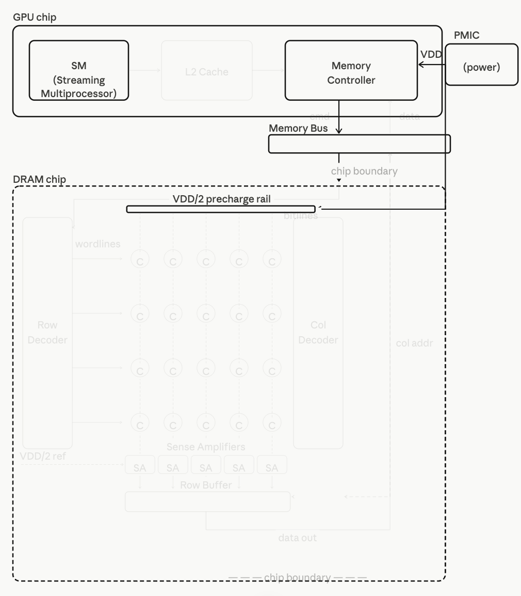

### 2. Row Activation

The **MC** sends the row address through the **Memory Bus** into the **DRAM chip**. The Row Decoder receives it and drives the target row's wordline HIGH. This opens the transistor in every cell of that row simultaneously—all columns connect to their respective bitlines at once.

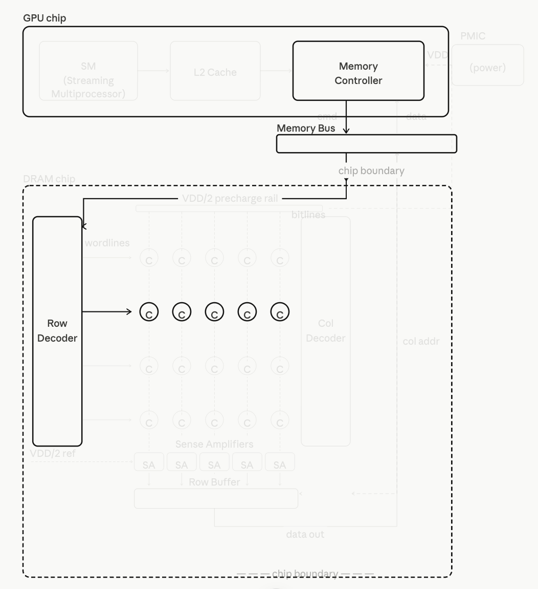

<details>
<summary><b>Deep Dive: Why 2D Grid Storage & Memory Coalescing?</b></summary>

To achieve massive capacity, DRAM cells are organized as a strict 2D grid of rows and columns rather than a simple 1D linear array. If cells were arranged in 1D, every single memory cell would require its own dedicated bitline, resulting in billions of wires that are physically impossible to route on a silicon chip. Organizing them in a 2D grid effectively slashes the number of required bitlines. However, this architectural compromise introduces a massive side effect: opening a single cell forces the wordline to activate an entire row of thousands of cells simultaneously. This is where memory coalescing shines—it elegantly exploits this hardware side effect. By ensuring that adjacent threads in a warp access adjacent memory addresses, the GPU can fully utilize the entire pre-activated row in one fell swoop, turning a physical limitation into a massive performance victory.


</details>

### 3. Charge Sharing

Each activated cell's capacitor shares its charge with a bitline. Because the capacitor is extremely small, the voltage shift on the bitline is only a few millivolts. **It acts like an ant momentarily pushing a massive cart—the initial physical impact is incredibly subtle.**

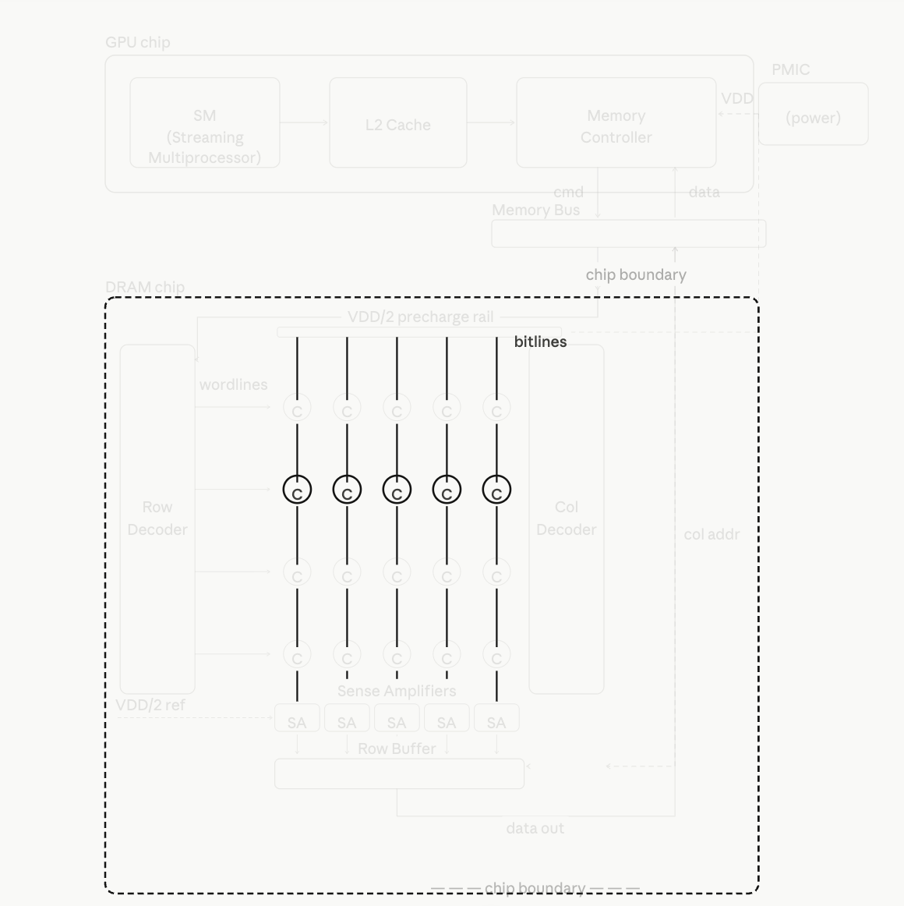

### 4. Sense Amplification

Each sense amplifier receives the **VDD/2** reference and waits for the bitline voltage shift to exceed the noise floor. Once the delta is large enough, it compares: if higher than **VDD/2** → 1, lower → 0. It then amplifies the signal to full **VDD** or **GND**, locking in the result and beginning to restore the capacitor. **Since the trapped charge is incredibly faint, the resulting voltage signal propagates to the amplifier and clears the noise floor at an extremely slow pace. Consequently, it takes a prolonged period for the sense amplifier to discern this microscopic differential. This twin-stage physical delay—signal emergence and subtle gap discrimination—is the absolute root cause of the dreaded memory access latency.**

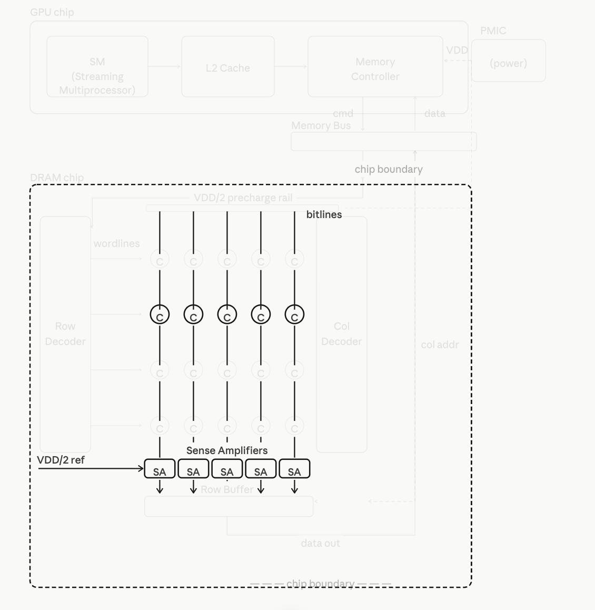

### 5. Row Buffer Latch

All sense amplifiers drive their results into the **Row Buffer**—the entire activated row is now latched in fast on-chip storage. This is the foundation of **memory coalescing**: subsequent accesses to any column in this row can be served directly from the **Row Buffer** without re-activating the **DRAM** cells.

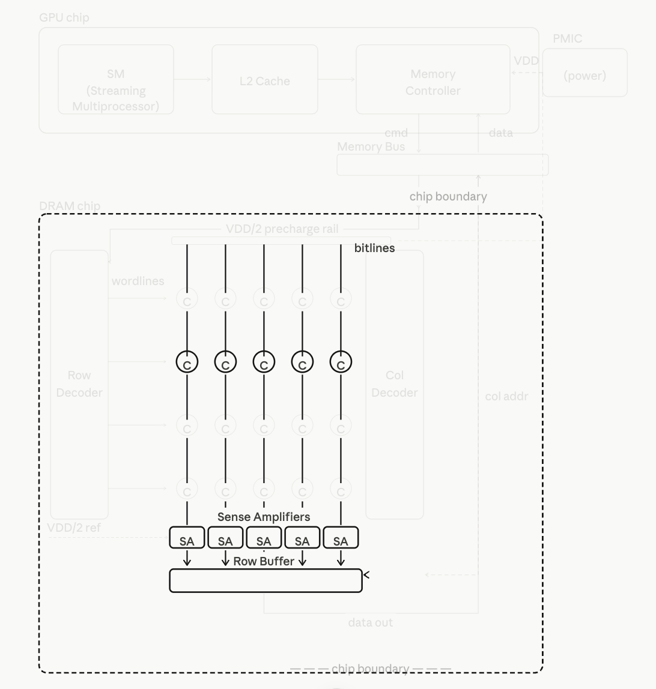

### 6. Column Select

The **MC** sends the column address through the **Memory Bus**. The **Column Decoder** selects the target column from the **Row Buffer** and gates its data onto the output path. Other columns remain cached and available in the **Row Buffer**.

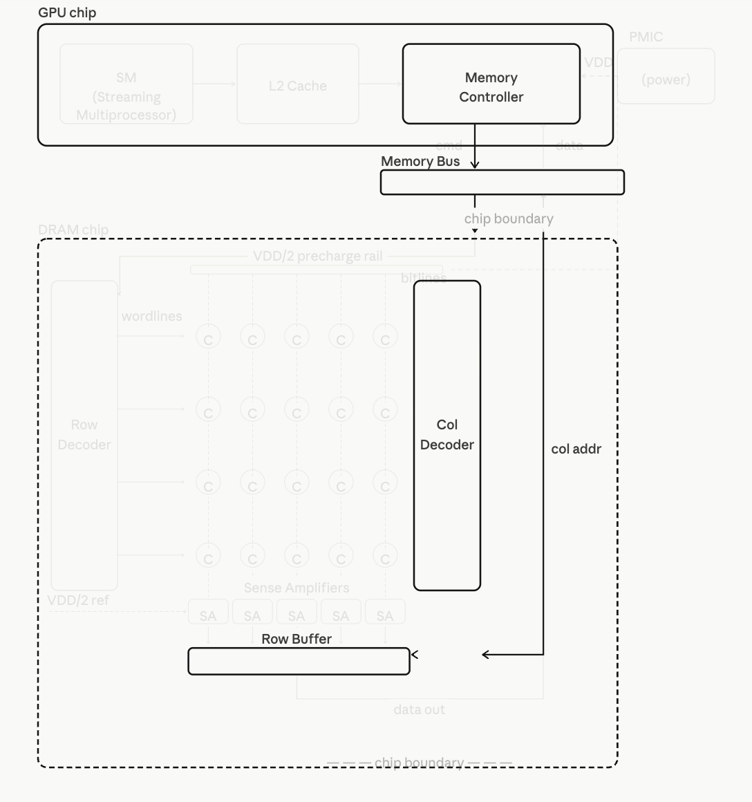

### 7. Data Return

The selected data travels from the **Row Buffer**, up through the **Memory Bus** (off-chip copper traces), back into the **GPU** chip, through the memory controller and **L2 Cache**, and finally to the **SM**. Total latency is approximately 200–800 clock cycles, during which **GPU** compute units stall if the latency cannot be hidden.

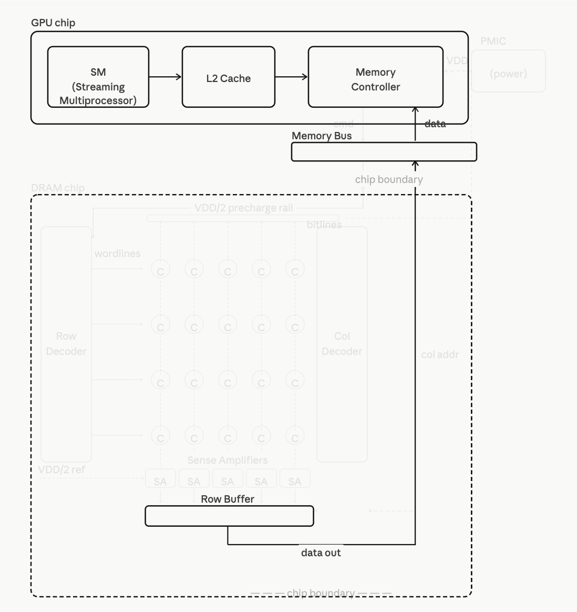
---

## Key Concepts

This chapter introducets 3 major approches to get higher performence: Memory coalescing, Hiding memory lantency, thread corsening 

---

## Notes

### 1. Memory Coalescing

As analyzed previously, DRAM cells are activated on a per-row basis. When a warp of threads accesses a contiguous block of memory, the Memory Controller can merge these parallel lookups into a single, unified request to exploit the hardware's native DRAM bursting. This drastically reduces the total number of distinct DRAM accesses, allowing the hardware to maximize bandwidth efficiency and alleviate congestion on the memory bus, preventing data traffic bottlenecks during transit.

<details>
<summary><b>Deep Dive: Physical Scale Disparity and Row Boundary Truncation</b></summary>
<br>
<b>Size Disparity in Reality</b>
<p>In physical hardware, a DRAM Row Buffer is massive (typically 1 KB to 2 KB), whereas a standard Warp request targeting 32-bit floats is much smaller (only 128 bytes). This massive size disparity means a single Row Buffer can easily accommodate the footprints of multiple continuous warps without needing to be an exact integer multiple.</p>
<br>
<b>Handling Row Boundary Truncation</b>
<p>If a warp's continuous memory request happens to be misaligned and gets truncated across a physical row boundary (one foot in the current row, one foot in the next), the Memory Controller handles it in a two-stage sequential manner. It will first execute the coalesced burst for the front segment within the currently active row, issue a PRECHARGE to close it, and then issue an ACTIVATE command to open the next uncovered row to finish the remaining coalesced burst.</p>
</details>

### 2. Hiding Memory Latency

At the beginning of our analysis, we assumed DRAM was simply a 2D array
of cells. In reality, the architecture is considerably more complex.

The complete access process — precharge, row activation, charge sharing,
sense amplification, column select — takes approximately 200 clock cycles
to complete. During this time, only a single data path is active. Bursting
alone is not sufficient to meet the bandwidth demands of modern processors.
DRAM systems therefore employ two additional levels of parallel
organization: **channels** and **banks**.

All DRAM cells are partitioned across multiple **channels**. Each channel
has its own independent data bus connecting it to the memory controller,
and each channel runs its own complete access process independently —
data, timing, and control are fully separate. Multiple channels can
therefore transfer data simultaneously, providing the most direct form of
parallelism: multiple independent roads carrying data at the same time.

Within each channel, cells are further divided into multiple **banks**.
A bank is the actual storage space assigned to that channel — a 2D array
of cells that the channel owns and accesses. Banks within the same channel
share the channel's data bus, so they cannot transfer data simultaneously.
However, each bank has its own row decoder and sense amplifiers, allowing
one bank to undergo precharge or row activation while another is
transferring data. This pipelining of DRAM operations across banks
effectively hides latency — while one bank is still recovering from an
access, another is already serving the next request.

Together, channels and banks allow the memory system to keep data flowing
to the processor continuously, turning the long latency of a single DRAM
access into sustained high bandwidth through overlapping and parallelism.
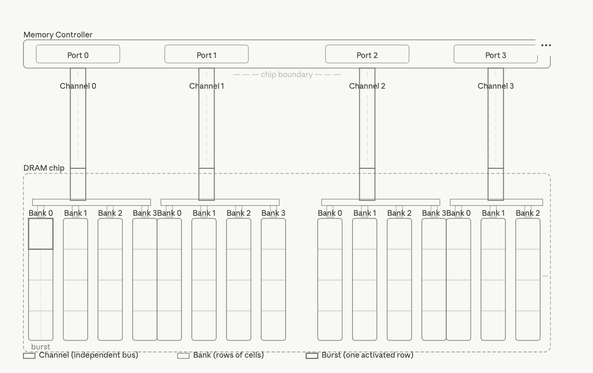

### 3. Memory Interleaving and Physical Distribution

When a continuous array or block of memory is allocated in the system,
the memory controller lays out this data across the physical hardware
using a round-robin "slicing and distributing" mechanism called
**Memory Interleaving**.

Instead of storing the entire array in a single physical location, the
system distributes the data according to the following strict
hierarchical cycle:

1. **Slicing by Hardware Step-Size:** The memory controller takes the
   continuous software address space and cuts it into fixed-size segments
   based on the hardware's optimal burst size (typically a **32-byte or
   64-byte granularity**), regardless of the data type or access pattern
   of the software.

2. **Multi-Channel Distribution (The First Dimension):** These segments
   are then distributed sequentially across all available **channels**.
   Segment 0 goes to Channel 0, Segment 1 goes to Channel 1, and so on.
   This ensures that adjacent data blocks are bound to completely
   independent physical data buses, enabling them to be accessed in
   parallel.

3. **Inter-Bank Rotation (The Second Dimension):** Within each channel,
   the assigned segment is further routed to a specific **bank** and
   written into a row of cells inside that bank. A burst transfer will
   later read consecutive bytes from that row in a single activation.

4. **The Round-Robin Loop:** Once every channel has received a segment
   for its current bank, the distribution cycle loops back to Channel 0
   and advances to the next bank index. This two-dimensional round-robin
   — channel-to-channel, then bank-to-bank — continues until all data
   is placed.

By executing this continuous distribution, a single contiguous software
array is effectively striped across the entire physical hardware topology.
This layout ensures that any sequential memory access pattern — such as
a warp reading consecutive addresses — will naturally span multiple
channels and banks simultaneously, maximizing both spatial parallelism
and pipeline utilization.

### 4. Thread Coarsening

In the previous matrix multiplication implementation, we assigned each
thread to compute exactly one output element. The advantage of
parallelizing work at the finest granularity is **transparent
scalability** — as hardware capabilities grow, application performance
scales up automatically without any code changes.

However, breaking tasks into indivisible units imposes a steep physical
toll on hardware. Without careful optimization, extreme concurrency
triggers severe architectural bottlenecks:

#### 1. Control Overhead

Unlike CPUs that dedicate silicon to large caches and complex ALUs, GPUs
must allocate massive silicon area to Warp Schedulers, Dispatch Units,
and large Register Files to track millions of fine-grained threads in
real-time. A significant portion of the transistor budget is spent on
thread management rather than raw computation.

#### 2. Resource Insufficiency & Occupancy Collapse

Every thread demands a physical slice of the SM's finite architectural
registers and shared memory. When threads over-consume these limited
resources, the scheduler can no longer host sufficient concurrent warps,
causing hardware occupancy to collapse. If a thread's variables exceed
its register budget, the hardware resorts to register spilling — pushing
local data out of high-speed registers into the significantly slower
global memory.

#### 3. Memory Bandwidth Waste

At the finest granularity, each thread accesses its own 4-byte element
independently. However, the DRAM controller distributes data at a
hardware step-size of 32 or 64 bytes across channels. If fine-grained
threads request scattered, non-consecutive addresses, the hardware must
launch a separate DRAM burst for every thread, discarding up to 87.5%
of the fetched data and severely degrading effective throughput.

#### 4. Branch Divergence

In the GPU's SIMT architecture, all 32 threads in a warp share a single
instruction issue unit. If conditional logic (`if-else`) causes threads
within a warp to diverge, the hardware must serialize execution —
masking the `else` lanes while running the `if` path, then reversing
the mask. In the worst case, this halves pipeline efficiency.

These bottlenecks share a common root: the cost of managing too many
threads often outweighs the benefit of the parallelism they provide.

**Thread coarsening** addresses this by assigning each thread more work.
Instead of mapping one thread to one output element, each thread is
responsible for computing multiple output elements — owning a contiguous
block of memory rather than a single location. This reduces the total
number of threads launched, cutting control overhead and register
pressure, while allowing each thread to reuse loaded data across
multiple computations. The key insight is that parallelism is preserved
where the hardware can exploit it, but redundant fine-grained management
cost is eliminated where it cannot.
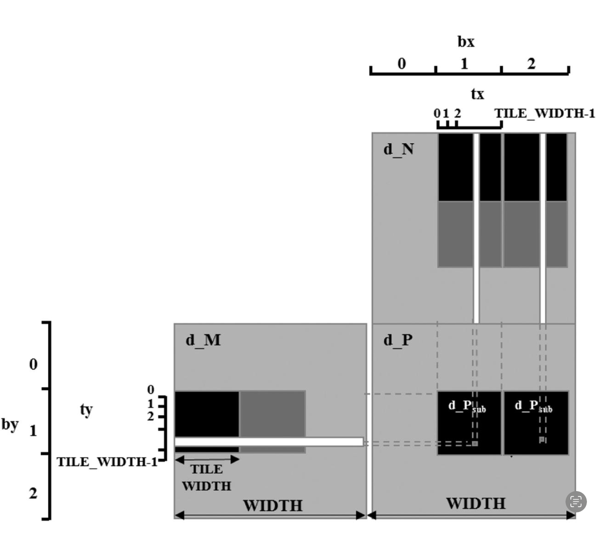

---

## Code

### There is the code in the book for thread coarsen
```cuda
#define TILE_WIDTH    32
#define COARSE_FACTOR 4
__global__ void matrixMulKernel(float* M, float* N, float* P, int width){
    
    __shared__ float Mds[TILE_WIDTH][TILE_WIDTH];
    __shared__ float Nds[TILE_WIDTH][TILE_WIDTH];

    int bx = blockIdx.x;  int by = blockIdx.y;
    int tx = threadIdx.x; int ty = threadIdx.y;

    //Identify the row and column of the P element to work on
    int row = by*TILE_WIDTH + ty;
    int colStart = bx*TILE_WIDTH + tx;

    //Initialize Pvalue for all output elements
    float Pvalue[COARSE_FACTOR];
    for (int c = 0; c < COARSE_FACTOR; ++c){
        Pvalue[c] = 0.0f;
    }

    //Loop over the M and N tiles required to compute P element
    for(int ph = 0; ph < width/TILE_WIDTH; ++ph){

        //Collaborative loading of M tile into shared memory
        Mds[ty][tx] = M[row*width + ph*TILE_WIDTH + tx];
        
        for(int c = 0; c <  COARSE_FACTOR; ++c){

            int col = colStart + c*TILE_WIDTH;
            Nds[ty][tx] = N[(ph*TILE_WIDTH + ty) * width + col];
            __syncthreads();

            for (int k = 0; k < TILE_WIDTH; ++k){
                Pvalue[c] += Mds[ty][k]*Nds[k][tx];
            }
            __syncthreads();
        }
    }

    for(int c = 0; c < COARSE_FACTOR; ++c) {
        int col = colStart + c*TILE_WIDTH;
        P[row*width + col] = Pvalue[c];
    }
}
```

### My optimized version 

```cuda
#define TILE_WIDTH    32
#define COARSE_FACTOR 4
__global__ void matrixMulKernel(float* M, float* N, float* P, int m, int k, int n){

    __shared__ float Mds[TILE_WIDTH][TILE_WIDTH];
    __shared__ float Nds[TILE_WIDTH][TILE_WIDTH];

    int bx = blockIdx.x;  int by = blockIdx.y;
    int tx = threadIdx.x; int ty = threadIdx.y;

    //Identify the row and column of the P element to work on 
    int row = by*TILE_WIDTH + ty;
    int colStart = bx*TILE_WIDTH + tx;

    //Initialize Pvalue for all output elements
    float Pvalue[COARSE_FACTOR];
    for(int c = 0; c < COARSE_FACTOR; ++c) {
        Pvalue[c] = 0.0f;
    }
    
    //Loop over the M and N tiles required to compute P element
    for(int ph = 0; ph < (k + TILE_WIDTH - 1)/TILE_WIDTH; ++ph ){
        
        //Collaborative loading of M tile into shared memory
        if(row < m && (ph*TILE_WIDTH + tx) < k  ){
            Mds[ty][tx] = M[row*k + ph*TILE_WIDTH + tx];
        }else {
            Mds[ty][tx] = 0.0f;
        }

        for(int c = 0; c < COARSE_FACTOR; ++c){
            int col = colStart + c*TILE_WIDTH;
            if((ph*TILE_WIDTH + ty) < k && col < n ){
                Nds[ty][tx] = N[(ph*TILE_WIDTH + ty)*n + col];
            }else {
                Nds[ty][tx] = 0.0f;
            }
            __syncthreads();

            for (int kk = 0; kk < TILE_WIDTH; ++kk){
                Pvalue[c] += Mds[ty][kk]*Nds[kk][tx];
            }
            __syncthreads();
        }
    }
    for(int c = 0; c < COARSE_FACTOR; ++c){
        int col = colStart + c*TILE_WIDTH;
        if(row < m && col < n ){
            P[row*n + col] = Pvalue[c];
        }
    }
}

```

---

## Exercise

### 1.Write a matrix multiplication kernel function that corresponds to the design illustrauted in Fig
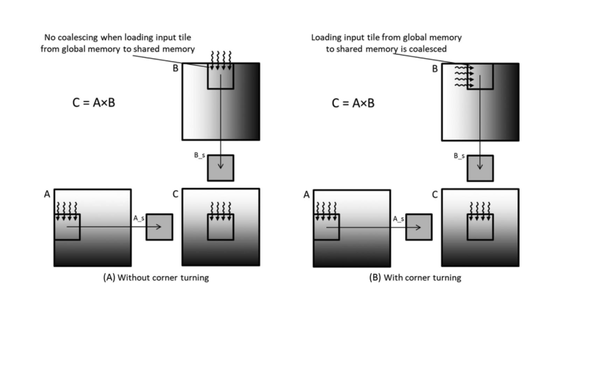

The scenario is a standard matrix multiplication C = A × B, where A is stored in row-major layout and B is stored in column-major layout in global memory. Accessing B row-by-row causes strided, non-coalesced memory accesses. The goal is to apply corner turning to resolve this by loading B into shared memory in a coalesced manner and handling the transposition there.

```cuda
__global__
void matrixMultiKernel_boundary(float* M, float* N, float* P, int m, int k, int n){
	
	__shared__ float Mds[TILE_WIDTH][TILE_WIDTH];
	__shared__ float Nds[TILE_WIDTH][TILE_WIDTH+1];

	int bx = blockIdx.x;  int by = blockIdx.y;
	int tx = threadIdx.x; int ty = threadIdx.y;
	
	//Identify the row and column of the P element to work on
	int Row = by * TILE_WIDTH + ty;
	int Col = bx * TILE_WIDTH + tx;


	//Loop over the M and N tiles required to compute P elemen
	float Pvalue = 0.0f;
	for(int ph = 0; ph <(k+TILE_WIDTH - 1) / TILE_WIDTH ; ++ph){

		int n_row = ph * TILE_WIDTH + tx;
		int n_col = bx * TILE_WIDTH + ty;

		if((Row < m) && (ph*TILE_WIDTH + tx)  < k) {
			Mds[ty][tx] = M[Row * k + ph * TILE_WIDTH + tx];
		}else {
			Mds[ty][tx] = 0.0f;
		}
		if((n_row) < k && n_col < n){
			Nds[tx][ty] = N[n_col*k + n_row];
		}else {
			Nds[tx][ty] = 0.0f;
		}
		__syncthreads();
		
		for (int i = 0; i < TILE_WIDTH; ++i) {
			Pvalue += Mds[ty][i] * Nds[i][tx];
		}
		__syncthreads();
	}
	if( Row < m && Col < n){
		P[Row*n + Col] = Pvalue;
	}
}
```

### 2.For tiled matrix multiplication, of the possible range of values for BLOCK_SIZE, for what values of BLOCK_SIZE will the kernel completely avoid uncoalesced accesses to global memory?(You need to consider only square blocks)

For tiled matrix multiplication with square blocks, coalescing depends
on how warps map to rows within a block.

A warp consists of 32 consecutive threads, numbered by:

$$\text{thread_id} = ty \times BLOCK\_SIZE + tx$$

For a warp to access global memory in a coalesced manner, all 32 threads
in the warp must have the same `ty` — meaning one warp maps exactly to
one row of the block, with `tx` varying from 0 to 31 consecutively.

This is only guaranteed when **`BLOCK_SIZE` is a multiple of 32**. In
that case, each row contains exactly one or more complete warps, and all
threads in a warp access consecutive memory addresses.

If `BLOCK_SIZE < 32` (e.g., `BLOCK_SIZE = 16`), a single warp spans
two rows:

$$\text{Warp 0} \rightarrow \begin{cases} \text{thread } 0\text{–}15 & (ty=0,\ tx=0..15) \\ \text{thread } 16\text{–}31 & (ty=1,\ tx=0..15) \end{cases}$$

The two halves access addresses from different rows, which are not
contiguous in memory — breaking coalescing.

Therefore, the kernel completely avoids uncoalesced global memory
accesses when:

$$BLOCK\_SIZE \in \{32,\ 64,\ 96,\ 128,\ \ldots\}$$

That is, any positive integer multiple of 32. In practice,
`BLOCK_SIZE = 32` is the most common choice since larger values may
exceed the maximum threads per block limit (typically 1024).

### 3. Consider the following CUDA kernel:

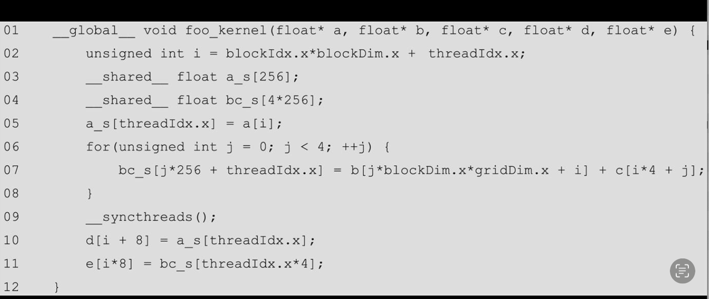

**For each of the following memory accesses, specifywhether they are coalesced or uncoalesced or coalescing is not applicable:**

- **a. The access to array a of line 05**

    Coalesced
     
- **b. The access to array a_s of line 05**

    Not applicable


- **c. The access to array b of line 07**

    Coalesced

- **d. The access to array c of line 07**

    Uncoalesced

- **e. The access to array bc_s of line 07**

    not applicable

- **f. The access to array a_s of line 10**

    not applicable

- **g. The access to array d of line 10**

    Coalesced

- **h. The access to array bc_s of line 11**

    not applicable

- **i. The access to array e of line 11**

    Uncoalesced


### 4. What is the floating point to global memory access ratio (in OP/B) of each of the following matrix-matrix multiplication kernels?  
**a. The simple kernel described in Chapter 3, Multidimensional Grids and Data, without any optimizations applied.**

```cuda
#include <stdio.h>
#define TILE_WIDTH 16
__global__
void matrixMultiply(float* M, float* N, float* P, int Width) {
	int col = blockIdx.x * blockDim.x + threadIdx.x;
	int row = blockIdx.y * blockDim.y + threadIdx.y;

	if (col < Width && row < Width) {
		float Pvalue = 0;
		for(int i = 0; i < Width; i++) {
			Pvalue += M[row * Width + i] * N[Width*i + col];
		}
		P[row * Width + col] = Pvalue;
	}
}
```

In this scenario, two float elements are loaded from global memory per
iteration — one from M and one from N — to perform one multiplication
and one addition. This gives an arithmetic intensity of 0.25 OP/B
(2 FLOPs / 8 bytes).

**b. The kernel described in Chapter 5, Memory Architecture and Data Locality, with shared memory tiling applied using a tile size of 32×32.**

```cuda
//Tiling Version
__global__
void matrixMultiKernel_boundary(float* M, float* N, float* P, int Width){
	
	__shared__ float Mds[TILE_WIDTH][TILE_WIDTH];
	__shared__ float Nds[TILE_WIDTH][TILE_WIDTH];

	int bx = blockIdx.x;  int by = blockIdx.y;
	int tx = threadIdx.x; int ty = threadIdx.y;
	
	//Identify the row and column of the P element to work on
	int Row = by * TILE_WIDTH + ty;
	int Col = bx * TILE_WIDTH + tx;

	//Loop over the M and N tiles required to compute P elemen
	float Pvalue = 0.0f;
	for(int ph = 0; ph < ceil (Width/ (float) TILE_WIDTH); ++ph){
		if((Row < Width) && (ph*TILE_WIDTH + tx)  < Width) {
			Mds[ty][tx] = M[Row * Width + ph * TILE_WIDTH + tx];
		}else {
			Mds[ty][tx] = 0.0f;
		}
		if((ph*TILE_WIDTH+ty) < Width && Col < Width){
			Nds[ty][tx] = N[(ph * TILE_WIDTH + ty)*Width + Col];
		}else {
			Nds[ty][tx] = 0.0f;
		}
		__syncthreads();
		
		for (int k = 0; k < TILE_WIDTH; ++k) {
				Pvalue += Mds[ty][k] * Nds[k][tx];
		}
		__syncthreads();
	}
	if (Row < Width && Col < Width) {
		P[Row*Width + Col] = Pvalue;
	}
}
```

For the tiled version, we calculate OP/B at the tile level since each
tile follows the same pattern of loading and computation.

**Bytes loaded from global memory (per tile):**

Each tile loads a `TILE_WIDTH × TILE_WIDTH` block from M and a
`TILE_WIDTH × TILE_WIDTH` block from N:

$$\text{Bytes} = 2 \times TILE\_WIDTH^2 \times 4 = 8 \times TILE\_WIDTH^2$$

**FLOPs performed (per tile):**

Each tile is responsible for `TILE_WIDTH × TILE_WIDTH` output elements.
Each output element performs `TILE_WIDTH` multiplications and
`TILE_WIDTH` additions:

$$\text{FLOPs} = TILE\_WIDTH^2 \times 2 \times TILE\_WIDTH = 2 \times TILE\_WIDTH^3$$

**Arithmetic Intensity:**

$$\text{OP/B} = \frac{2 \times TILE\_WIDTH^3}{8 \times TILE\_WIDTH^2} = \frac{TILE\_WIDTH}{4}$$

For `TILE_WIDTH = 32`:

$$\text{OP/B} = \frac{32}{4} = 8$$

Compared to the naive version's 0.25 OP/B, tiling achieves a **32×
improvement** in arithmetic intensity. The key reason is that each
float loaded from global memory is reused `TILE_WIDTH` times in shared
memory, spreading the cost of a single global memory access across
multiple computations.

**c. The kernel described in this chapter with shared memory tiling applied using a tile size of 32×32 and thread coarsening applied using a coarsening factor of 4.**

```cuda
#define TILE_WIDTH    32
#define COARSE_FACTOR 4
__global__ void matrixMulKernel(float* M, float* N, float* P, int width){
    
    __shared__ float Mds[TILE_WIDTH][TILE_WIDTH];
    __shared__ float Nds[TILE_WIDTH][TILE_WIDTH];

    int bx = blockIdx.x;  int by = blockIdx.y;
    int tx = threadIdx.x; int ty = threadIdx.y;

    //Identify the row and column of the P element to work on
    int row = by*TILE_WIDTH + ty;
    int colStart = bx*TILE_WIDTH + tx;

    //Initialize Pvalue for all output elements
    float Pvalue[COARSE_FACTOR];
    for (int c = 0; c < COARSE_FACTOR; ++c){
        Pvalue[c] = 0.0f;
    }

    //Loop over the M and N tiles required to compute P element
    for(int ph = 0; ph < width/TILE_WIDTH; ++ph){

        //Collaborative loading of M tile into shared memory
        Mds[ty][tx] = M[row*width + ph*TILE_WIDTH + tx];
        
        for(int c = 0; c <  COARSE_FACTOR; ++c){

            int col = colStart + c*TILE_WIDTH;
            Nds[ty][tx] = N[(ph*TILE_WIDTH + ty) * width + col];
            __syncthreads();

            for (int k = 0; k < TILE_WIDTH; ++k){
                Pvalue[c] += Mds[ty][k]*Nds[k][tx];
            }
            __syncthreads();
        }
    }

    for(int c = 0; c < COARSE_FACTOR; ++c) {
        int col = colStart + c*TILE_WIDTH;
        P[row*width + col] = Pvalue[c];
    }
}
```

With shared memory tiling (TILE_WIDTH = 32) and thread coarsening
(COARSE_FACTOR = 4), we calculate OP/B at the tile level.

**Bytes loaded from global memory (per tile iteration):**

- M tile: `TILE_WIDTH × TILE_WIDTH` floats
$$\text{Bytes}_M = 32 \times 32 \times 4 = 4096 \text{ bytes}$$

- N tile: each thread loads 4 columns, so the tile spans
`TILE_WIDTH × (COARSE_FACTOR × TILE_WIDTH)` floats
$$\text{Bytes}_N = 32 \times (4 \times 32) \times 4 = 16384 \text{ bytes}$$

- Total:
$$\text{Bytes} = 4096 + 16384 = 20480 \text{ bytes}$$

**FLOPs (per tile iteration):**

The tile is responsible for `TILE_WIDTH × (COARSE_FACTOR × TILE_WIDTH)`
output elements, each performing `2 × TILE_WIDTH` FLOPs:

$$\text{FLOPs} = 32 \times (4 \times 32) \times 2 \times 32 = 262144 \text{ FLOPs}$$

**Arithmetic Intensity:**

$$\text{OP/B} = \frac{262144}{20480} = 12.8 \text{ OP/B}$$

In general form:

$$\text{OP/B} = \frac{2 \times COARSE\_FACTOR \times TILE\_WIDTH^3}{4 \times TILE\_WIDTH^2 \times (1 + COARSE\_FACTOR)} = \frac{COARSE\_FACTOR \times TILE\_WIDTH}{2(1 + COARSE\_FACTOR)}$$

For TILE\_WIDTH = 32 and COARSE\_FACTOR = 4:

$$\text{OP/B} = \frac{4 \times 32}{2 \times 5} = \frac{128}{10} = 12.8 \text{ OP/B}$$

Compared to tiling alone (8 OP/B), adding thread coarsening further
reduces global memory traffic by reusing the M tile across
COARSE\_FACTOR output columns, achieving a **1.6× improvement** in
arithmetic intensity.
